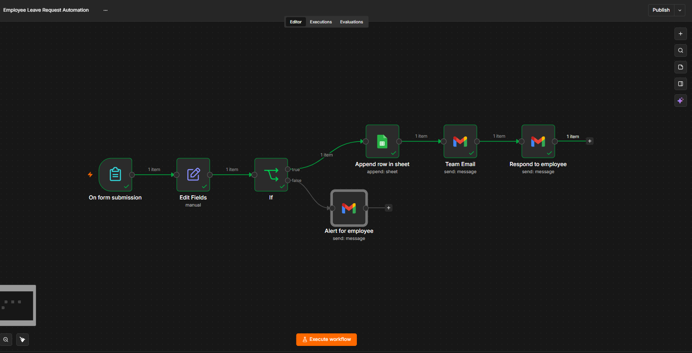
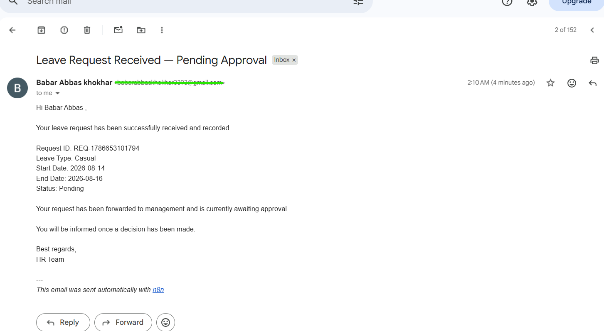
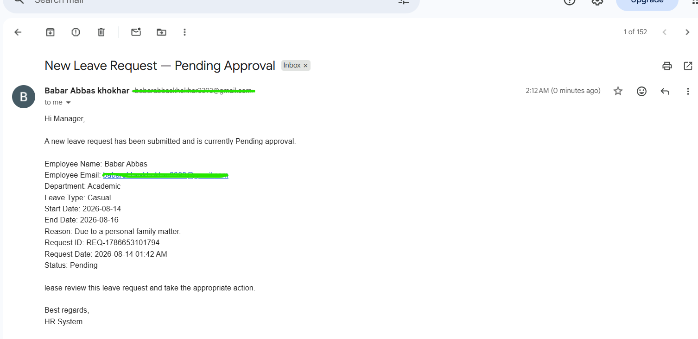
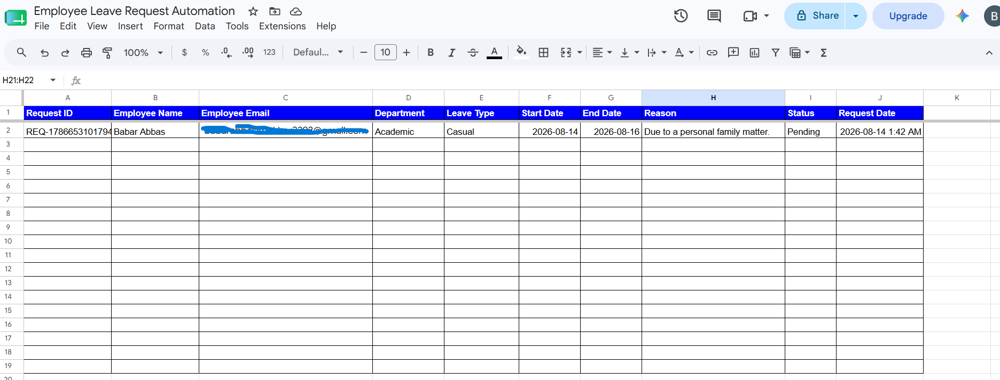
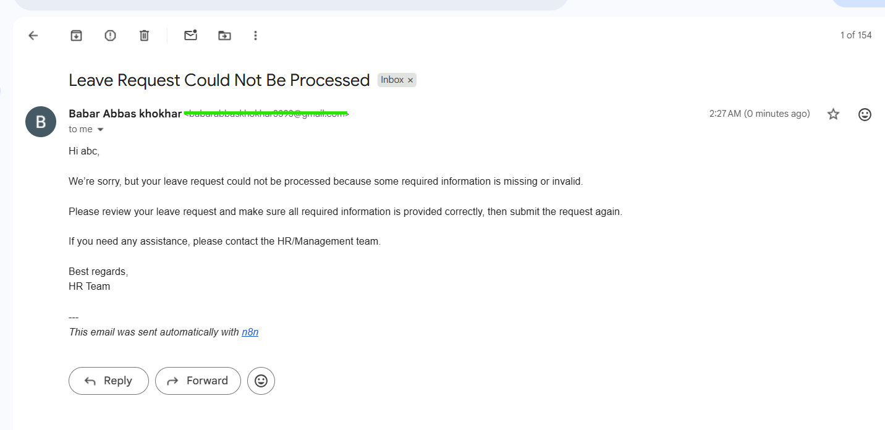

# 📩 Employee Leave Request Automation

A simple n8n workflow that automatically handles employee leave requests, validates the submitted information, stores valid requests in Google Sheets, and sends email notifications to management and employees.

The workflow also rejects incomplete or invalid requests, preventing them from being stored as valid leave records.

---

# 📸 Workflow

## n8n Workflow



---

## Employee Confirmation



---

## Manager Notification



---

## Google Sheets



---

## Invalid Request Test



---

# ✨ Features

- Receive employee leave requests through an n8n form
- Validate required leave request information
- Generate a unique Request ID
- Store valid leave requests in Google Sheets
- Set new leave requests to `Pending`
- Record the request date
- Send email notifications to management
- Send confirmation emails to employees
- Handle invalid or incomplete submissions
- Prevent invalid requests from being stored in Google Sheets

---

# 🔄 Workflow Steps

1. Form Trigger receives the employee's leave request.
2. Edit Fields prepares the submitted information and generates a Request ID.
3. The workflow checks whether all required fields are provided.
4. Valid requests continue to Google Sheets.
5. The leave request is stored with a `Pending` status.
6. A notification email is sent to the management team.
7. A confirmation email is sent to the employee.
8. Invalid requests are routed to an employee notification instead of being stored.

---

# 🛠 Technologies Used

- n8n
- Google Sheets
- Gmail

---

# 📁 Project Structure

```text
.
├── README.md
└── screenshots
    ├── n8n-workflow.png
    ├── employee-confirmation.png
    ├── manager-notification.png
    ├── google-sheet.png
    └── invalid-request.png
---

```
    
  # 🚀 Getting Started

This project is presented as a portfolio demonstration.

The complete working n8n workflow JSON is kept private and is available upon request.

To recreate or deploy the automation, the workflow can be configured using:

- n8n
- Google Sheets
- Gmail

---

# 💡 Use Cases

- Employee Leave Management
- HR Automation
- Leave Request Processing
- Employee Notifications
- Management Notifications
- Internal Business Process Automation
- Employee Record Management

---

# 🔐 Workflow Source

The complete working n8n workflow JSON is kept private to protect the reusable workflow implementation.

**Workflow JSON:** Available upon request.

---

# 📜 License

This project is presented for portfolio and demonstration purposes.

⭐ If you found this project useful, consider giving it a star on GitHub.
